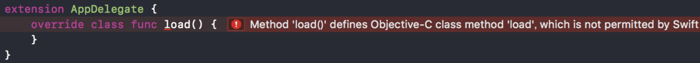
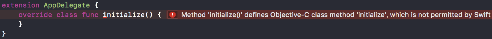

<p align="center">
  
</p>
<p align="center">
  
  <a href="https://developer.apple.com/swift">
    
  </a>
  <a href="./LICENSE">
    
  </a>
  <br />
  <a href="https://github.com/Carthage/Carthage">
    
  </a>
  <a href="https://github.com/apple/swift-package-manager">
    
  </a>
  <a href="http://cocoapods.org/pods/Degu">
    
  </a>
</p>

If you want to get all events of an application, you can get events from `UIApplication.sendEvent(_:)`. But, following implementations are needed to get events from it.

```swift
/* MyApplication.swift */

class MyApplication: UIApplication {
    override sendEvent(_ event: UIEvent) {
        super.sendEvent(event)
        print(event)
    }
}
```

```swift
/* main.swift */

private let applicationClassName: String = {
    #if DEBUG
        return NSStringFromClass(MyApplication.self)
    #else
        return NSStringFromClass(UIApplication.self)
    #endif
}()

UIApplicationMain(
    CommandLine.argc,
    UnsafeMutableRawPointer(CommandLine.unsafeArgv)
        .bindMemory(
            to: UnsafeMutablePointer<Int8>.self,
            capacity: Int(CommandLine.argc)),
    applicationClassName,
    NSStringFromClass(AppDelegate.self)
)
```

```swift
/* AppDelegate.swift */

// @UIApplicationMain <- comment out
class AppDelegate: UIResponder, UIApplicationDelegate {
    ...
}
```

`Degu` makes them easy!!

## Usage

### 1. ApplicationProxy

This is an example. There are only 2 implementations what you have to.

- set a delegate to `ApplicationProxy.shared.delegate`
- implement `ApplicationProxyDelegate`

```swift
import Degu

class AppDelegate: UIResponder, ApplicationDelegate {
    ...

    func application(_ application: UIApplication, didFinishLaunchingWithOptions launchOptions: [UIApplicationLaunchOptionsKey: Any]?) -> Bool {
        // Override point for customization after application launch.

        #if DEBUG
        ApplicationProxy.shared.delegate = self
        #endif

        ...

        return true
    }

    ...
}

extension AppDelegate: ApplicationProxyDelegate {
    func applicationProxy(_ proxy: ApplicationProxy, didSendEvent event: UIEvent) {
        print(event)
    }
}
```

In addition, you can get lifecycle method call of all ViewControllers.

```swift
func applicationProxy(_ proxy: ApplicationProxy, didCallLifeCycle lifeCycle: ViewControllerLifeCycle, ofViewController viewController: UIViewController) {
    print("ViewController = \(viewController)")
    print("LifeCycle = \(lifeCycle)")
}
```

### 2. Override load or initialize method

[+(void)load](https://developer.apple.com/documentation/objectivec/nsobject/1418815-load) and [+(void)initialize](https://developer.apple.com/documentation/objectivec/nsobject/1418639-initialize) are not permitted by Swift.





You can override `+(void)load` and `+(void)initialize` in **Extension of RuntimeHandler**.

```swift
extension RuntimeHandler {
    open override class func handleLoad() {
        // do something
    }

    open override class func handleInitialize() {
        // do something
    }
}
```

⚠️ `handleLoad` and `handleInitialize` are not called **Subclass of RuntimeHandler**. It only works in **Extension of RuntimeHandler**.

## Installation

### Carthage

If you’re using [Carthage](https://github.com/Carthage/Carthage), simply add Degu to your `Cartfile`:

```
github "cats-oss/Degu"
```

### CocoaPods

Degu is available through [CocoaPods](http://cocoapods.org). To install
it, simply add the following line to your Podfile:

```ruby
pod 'Degu'
```

### Swift Package Manager

If you’re using [Swift Package Manager](https://github.com/apple/swift-package-manager), simply add Degu to your `Package.swift`:

```swift
dependencies: [
    .package(url: "https://github.com/cats-oss/Degu", from: "0.1.0")
]
```

## Requirements

- Xcode 9.3
- Swift 4.1

## License

Degu is available under the MIT license. See the LICENSE file for more info.
